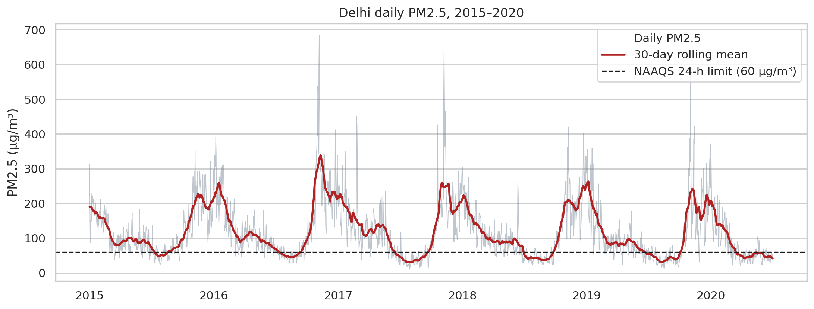
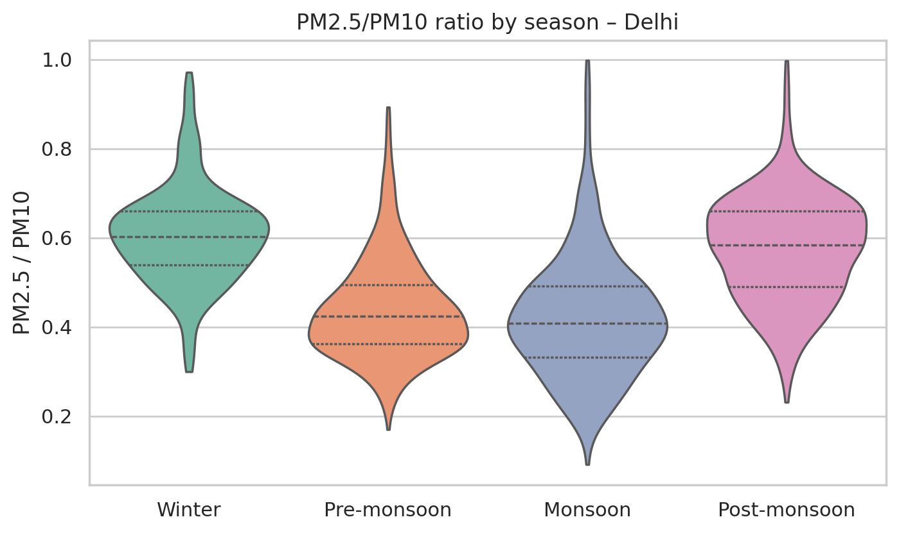
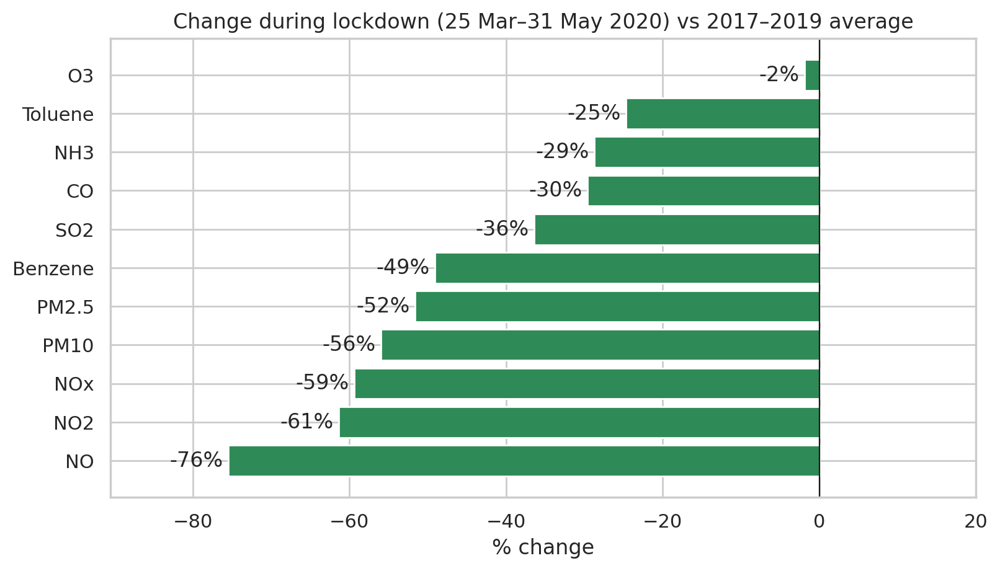
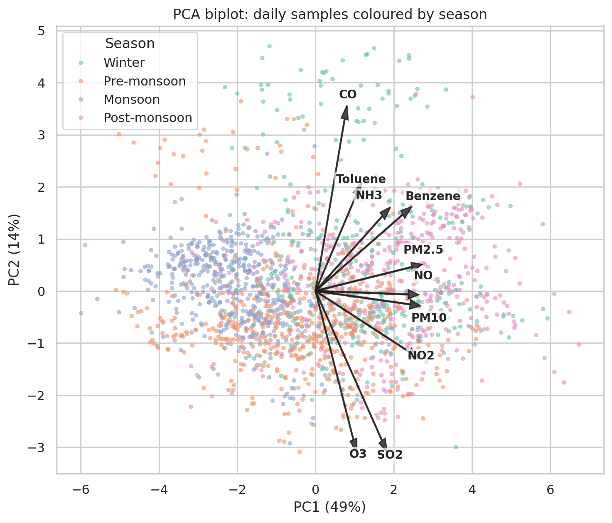
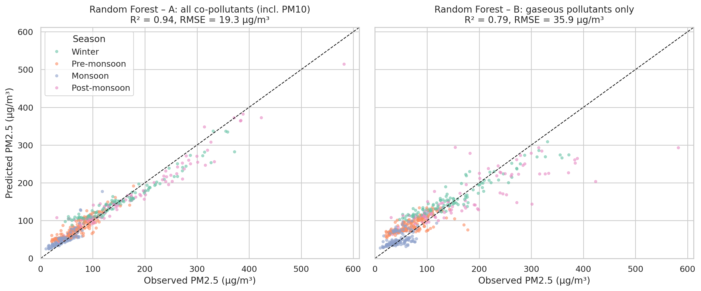

# Delhi Air Quality (2015–2020): Seasonal Trends, Source Patterns & PM2.5 Prediction

Exploratory analysis of **2,009 days of CPCB monitoring data for Delhi** to answer four questions:

1. How does PM2.5 vary across seasons and years, and how often does it breach the Indian 24-h standard (NAAQS, 60 µg/m³)?
2. What does the pollutant mix (PM2.5/PM10 ratio, correlations, PCA) suggest about the sources behind it?
3. What did the **COVID-19 lockdown** — a natural experiment in reduced traffic and industry — do to each pollutant?
4. How well can daily PM2.5 be predicted from co-measured pollutants, and which pollutants carry the most information?

📄 **Full technical report:** [`report/Delhi_Air_Quality_Technical_Report.pdf`](report/Delhi_Air_Quality_Technical_Report.pdf)
📓 **Analysis notebook:** [`notebooks/delhi_air_quality_analysis.ipynb`](notebooks/delhi_air_quality_analysis.ipynb)

---

## Key findings

| | Result |
|---|---|
| **NAAQS exceedance** | PM2.5 exceeded 60 µg/m³ on **84% of days in 2015** and **67% in 2019**. Monthly means in Nov–Jan are roughly 2.5–5× the limit (peak: 306 µg/m³, Nov 2016). |
| **Combustion vs dust** | PM2.5/PM10 ratio is **0.61 in winter** and **0.57 post-monsoon** vs **~0.43** in pre-monsoon/monsoon → cold-season episodes are combustion/secondary-aerosol dominated, not dust. |
| **PCA** | 3 components explain 75.5% of variance: a **common combustion/accumulation factor** (PM, NOx, benzene; 49%), a **cold-season CO factor** contrasted with photochemical O3 (14%), and a separate **toluene/VOC factor** (12%). |
| **Lockdown (25 Mar–31 May 2020 vs 2017–19)** | NO **−76%**, NO2 **−61%**, PM2.5 **−52%**, benzene **−49%** — but **O3 only −2%**, consistent with reduced NO titration of ozone. |
| **Prediction (train 2015–18, test 2019–20)** | Random forest: **R² = 0.79** from gaseous pollutants only, **R² = 0.94** with PM10, vs **R² = 0.41** for a seasonal-climatology baseline. **Benzene** is the most informative gas. |
| **Model failure under regime change** | The gas-only model's bias is +4.6 µg/m³ normally but **+24.1 µg/m³ (+50%) during lockdown** — data-driven models encode the emission regime they were trained on. |

<p align="center"></p>
<p align="center"> </p>
<p align="center"> </p>

---

## Methods

**Data** — CPCB continuous monitoring, daily city averages for Delhi (PM2.5, PM10, NO, NO2, NOx, NH3, CO, SO2, O3, benzene, toluene). See [`data/README.md`](data/README.md).

**Quality control**
- Exact zeros in CO (87 days), toluene (108), benzene (8), NOx (2) treated as sensor dropouts.
- Gaps ≤ 7 days filled by time interpolation.
- **16 days where PM2.5 > PM10** (physically impossible) flagged and excluded from the ratio analysis — likely an artefact of city averages built from different station sets.
- Seasons follow IMD definitions.

**Analysis**
- Exceedance frequency against NAAQS 2009 (24-h PM2.5 = 60 µg/m³).
- Spearman correlation; PCA on log-transformed, standardised data (Kaiser criterion, eigenvalue > 1).
- Lockdown effect: 25 Mar–31 May 2020 vs mean of the same window in 2017–2019.
- Prediction: Linear Regression and Random Forest with a **chronological train/test split** (random splits leak information through day-to-day autocorrelation), two feature sets (with / without PM10), seasonal-climatology baseline, and permutation importance.

## Limitations
- City-averaged data (no station-level detail).
- **No meteorology** — emission and weather effects cannot be separated.
- **PCA is not source apportionment**; formal apportionment needs speciated PM and receptor models (e.g. PMF).
- Five-year record; the declining exceedance trend is descriptive, not statistically tested.

## Possible extensions
- Add ERA5/IMD meteorology · Station-level CAAQMS analysis · Link post-monsoon peaks to NASA FIRMS fire counts · PMF on speciated PM2.5.

---

## Repository structure
```
├── data/
│   ├── delhi_city_day_2015_2020.csv     # raw Delhi subset (CPCB via Kaggle)
│   └── README.md                        # source, units, columns
├── notebooks/
│   └── delhi_air_quality_analysis.ipynb # full analysis, executed with outputs
├── figures/                             # 11 figures (PNG, 200 dpi)
├── results/                             # all result tables as CSV
├── report/
│   └── Delhi_Air_Quality_Technical_Report.pdf
├── requirements.txt
└── README.md
```

## Reproduce
```bash
pip install -r requirements.txt
cd notebooks
jupyter notebook delhi_air_quality_analysis.ipynb   # Run All — regenerates figures/ and results/
```
Or open the notebook in Google Colab and upload `data/delhi_city_day_2015_2020.csv`.

## Author
**[Your Name]** — B.Tech. Civil Engineering, NIT Srinagar · [email] · [LinkedIn]

## References
- CPCB (2009). *National Ambient Air Quality Standards*. Gazette of India, 18 Nov 2009.
- Sharma, D. & Mauzerall, D. L. (2022). Analysis of air pollution data in India between 2015 and 2019. *Aerosol and Air Quality Research*, 22, 210204.
- Paatero, P. & Tapper, U. (1994). Positive matrix factorization. *Environmetrics*, 5, 111–126.
- Breiman, L. (2001). Random forests. *Machine Learning*, 45, 5–32.
- Rao, R. (2020). *Air Quality Data in India (2015–2020)* [dataset]. Kaggle.
